# Burn-in Subtitle Checker

Burn-in Subtitle Checker compares subtitle text that is already visible inside a video frame with the speech transcription generated from that video's audio. It is useful when the subtitles are burned into the video or visually rendered in the frame, and there is no separate `.srt` subtitle file to inspect.

The pipeline extracts audio, transcribes speech with Whisper, runs OCR on subtitle regions from sampled video frames, compares both text sources with RapidFuzz, and generates JSON plus HTML reports for review.

## Architecture Flow

```mermaid
flowchart TD
    A[Input video folder] --> B[main.py batch orchestrator]
    B --> C[Find supported video files]
    C --> D[Process each video]

    D --> E[Create per-video output folder]
    D --> F[Create shared audio output folder]

    E --> G[Extract audio with FFmpeg]
    F --> G
    G --> H[16 kHz mono WAV file]

    H --> I[Whisper turbo transcription]
    I --> J[Transcript JSON]
    J --> J1[language_detected]
    J --> J2[segment start time]
    J --> J3[segment end time]
    J --> J4[segment text]

    D --> K[Subtitle OCR extraction]
    J --> K

    K --> L[Load transcript segments]
    L --> M[Map Whisper language to Tesseract language]
    M --> M1[hi to hin]
    M --> M2[en to eng]
    M --> M3[kn to kan]
    M --> M4[unknown language to eng+hin+kan]

    L --> N[For each transcript segment]
    N --> O[Calculate segment duration]
    O --> P[Sample three frame timestamps]
    P --> P1[start + 15 percent]
    P --> P2[start + 50 percent]
    P --> P3[start + 85 percent]

    P1 --> Q[Capture video frame]
    P2 --> Q
    P3 --> Q

    Q --> R[Save original debug frame]
    Q --> S[Crop subtitle strip]
    S --> S1[Find real bottom using row standard deviation]
    S1 --> S2[Use bottom 15 percent for landscape]
    S1 --> S3[Use bottom 20 percent for portrait]
    S2 --> T[Save cropped debug strip]
    S3 --> T

    T --> U[Preprocess for OCR]
    U --> U1[Convert to grayscale]
    U1 --> U2[Remove uniform side padding]
    U2 --> U3[Mask noisy top corners]
    U3 --> U4[Detect text rows]
    U4 --> U5[Resize before thresholding]
    U5 --> U6[Detect subtitle style]

    U6 --> V{Text style}
    V -->|outlined_white| V1[Repair outlined text]
    V -->|light_on_dark| V2[Invert then adaptive threshold]
    V -->|dark_on_light| V3[Adaptive threshold]

    V1 --> W[Normalize to black text on white background]
    V2 --> W
    V3 --> W
    W --> X[Save processed debug image]

    X --> Y[Run OCR]
    Y --> Z[Tesseract with mapped language]
    Z --> AA{Acceptable OCR?}
    AA -->|yes| AB[Clean OCR text]
    AA -->|no| AC[EasyOCR fallback]
    AC --> AD{Acceptable OCR?}
    AD -->|yes| AB
    AD -->|no| AE{Already using fallback languages?}
    AE -->|no| AF[Retry Tesseract with eng+hin+kan]
    AE -->|yes| AG[OCR failed]
    AF --> AH{Acceptable OCR?}
    AH -->|yes| AB
    AH -->|no| AI[Retry EasyOCR with eng+hin+kan]
    AI --> AJ{Acceptable OCR?}
    AJ -->|yes| AB
    AJ -->|no| AG

    AB --> AK[OCR cleanup and validation]
    AK --> AK1[Unicode NFC normalize]
    AK1 --> AK2[Remove repeated characters and fragments]
    AK2 --> AK3[Validate expected script]
    AK3 --> AK4[Reject suspicious symbols and noisy text]
    AG --> AL[Frame OCR result]
    AK4 --> AL

    AL --> AM[Collect start, middle, end OCR text]
    AM --> AN[Consolidate OCR results]
    AN --> AO{Subtitle stable?}
    AO -->|yes| AP[Keep best quality OCR text]
    AO -->|changed| AQ[Join unique valid subtitle parts]
    AO -->|no valid OCR| AR[Mark ocr_failed]

    AP --> AS[ocr_output.json]
    AQ --> AS
    AR --> AS

    J --> AT[Mismatch detector]
    AS --> AT
    AT --> AU[Compare transcript and OCR by segment]
    AU --> AV[Normalize audio text]
    AU --> AW[Normalize OCR text]
    AV --> AX[RapidFuzz token_sort_ratio]
    AW --> AX

    AX --> AY{Score classification}
    AY -->|score >= 0.8| AZ[OK]
    AY -->|score >= 0.6| BA[REVIEW]
    AY -->|score < 0.6| BB[MISMATCH]
    AY -->|missing OCR| BC[OCR_FAILED]

    AZ --> BD[mismatch_report.json]
    BA --> BD
    BB --> BD
    BC --> BD

    BD --> BE[HTML report generator]
    BE --> BF[mismatch_report.html]
    AS --> BG[debug images folder]
    J --> BH[final output folder]
    BD --> BH
    BF --> BH
    BG --> BH
```



## Current Pipeline

1. **Video discovery**
   `main.py` scans the input directory for video files with these extensions: `.mp4`, `.mov`, `.mkv`, `.avi`, and `.webm`.

2. **Audio extraction**
   `src/transcriber.py` calls FFmpeg and creates a mono `16 kHz` WAV file for each video.

3. **Speech transcription**
   Whisper loads the `turbo` model and transcribes the extracted WAV file. The transcript JSON stores the detected language and timestamped segments.

4. **Language mapping**
   `src/subtitle_extractor.py` maps Whisper language codes to Tesseract language codes:
   `hi -> hin`, `en -> eng`, and `kn -> kan`. Unknown languages fall back to `eng+hin+kan`.

5. **Frame sampling**
   For every transcript segment, the extractor samples three frames at `15%`, `50%`, and `85%` of that segment duration. These avoid exact segment boundaries where subtitles may be fading in or out.

6. **Subtitle crop**
   The extractor crops the likely subtitle area near the bottom of the frame. It uses `15%` of the bottom area for landscape videos and `20%` for portrait videos.

7. **OCR preprocessing**
   OpenCV prepares the crop for OCR by converting to grayscale, removing side padding, masking noisy corners, detecting active text rows, resizing before thresholding, detecting subtitle style, and converting the result to black text on a white background.

8. **OCR execution**
   Tesseract runs first. If its output is empty or rejected as noisy, EasyOCR is tried. If the detected-language OCR fails, both engines are retried with `eng+hin+kan`.

9. **OCR validation**
   OCR text is normalized, repeated characters/fragments are reduced, unexpected scripts are rejected, suspicious symbols are penalized, and low-quality text is filtered out.

10. **Frame consolidation**
    The start, middle, and end OCR results are consolidated. Stable subtitles keep the best quality OCR text. Changed subtitles are joined only when the parts are unique and valid.

11. **Mismatch detection**
    `src/mismatch_detector.py` normalizes the transcript and OCR text, then compares them using RapidFuzz `token_sort_ratio`.

12. **Report generation**
    `src/report_generator.py` creates an HTML table with segment timings, transcript text, OCR text, similarity score, and final status.

## Status Classification

| Status | Meaning |
| --- | --- |
| `OK` | Similarity score is `>= 0.8` |
| `REVIEW` | Similarity score is `>= 0.6` and `< 0.8` |
| `MISMATCH` | Similarity score is `< 0.6` |
| `OCR_FAILED` | OCR text is missing or too short |

## Tech Stack

| Area | Technology |
| --- | --- |
| Language | Python 3.12+ |
| CLI | `argparse` |
| Audio extraction | FFmpeg |
| Transcription | OpenAI Whisper `turbo` |
| Image processing | OpenCV, NumPy |
| Primary OCR | Tesseract via `pytesseract` |
| Fallback OCR | EasyOCR |
| Text matching | RapidFuzz |
| Config loading | `python-dotenv` |
| Reports | JSON and HTML |
| Dependency files | `requirements.txt`, `pyproject.toml`, `uv.lock` |

## Project Structure

```text
.
|-- main.py
|-- README.md
|-- Improvemnt.README.md
|-- pyproject.toml
|-- requirements.txt
|-- src
|   |-- __init__.py
|   |-- mismatch_detector.py
|   |-- report_generator.py
|   |-- subtitle_extractor.py
|   `-- transcriber.py
|-- input
`-- output
```

Key files:

- `main.py`: CLI entry point, batch runner, and pipeline orchestrator.
- `src/transcriber.py`: FFmpeg audio extraction and Whisper transcription.
- `src/subtitle_extractor.py`: frame sampling, subtitle cropping, preprocessing, OCR fallback, cleanup, and consolidation.
- `src/mismatch_detector.py`: transcript-versus-OCR comparison.
- `src/report_generator.py`: HTML report creation.
- `Improvemnt.README.md`: known issues and future improvement plan.

## Setup

Install Python dependencies:

```bash
pip install -r requirements.txt
```

Install system dependencies:

- FFmpeg must be available on `PATH`.
- Tesseract OCR must be installed separately.
- Tesseract language data should be installed for English, Hindi, and Kannada if those languages are needed.

Create a `.env` file in the project root:

```env
TESSERACT_FILE_PATH=C:\Program Files\Tesseract-OCR\tesseract.exe
```

## Usage

Put videos inside the `input` folder and run:

```bash
python main.py
```

Or pass custom folders:

```bash
python main.py --input-dir input --output-dir output
```

The default input folder is `input`, and the default output folder is `output`.

## Output

For each processed video, the project creates this structure:

```text
output
|-- audio
|   `-- video_name.wav
`-- video_name
    |-- video_name.wav.json
    |-- ocr_output.json
    |-- mismatch_report.json
    |-- mismatch_report.html
    `-- images
        |-- original_seg*_start.jpg
        |-- original_seg*_mid.jpg
        |-- original_seg*_end.jpg
        |-- cropped_seg*_start.jpg
        |-- cropped_seg*_mid.jpg
        |-- cropped_seg*_end.jpg
        |-- debug_seg*_start.jpg
        |-- debug_seg*_mid.jpg
        `-- debug_seg*_end.jpg
```

Important files:

- `video_name.wav.json`: Whisper transcript with language and timestamps.
- `ocr_output.json`: OCR text, timestamp, consolidation status, and frames used.
- `mismatch_report.json`: segment-level comparison results.
- `mismatch_report.html`: readable HTML report.
- `images/original_*.jpg`: raw sampled video frames.
- `images/cropped_*.jpg`: cropped subtitle regions.
- `images/debug_*.jpg`: final images passed to OCR.
- `debug.log`: processing logs, OCR fallback details, warnings, and exceptions.

## OCR Reliability Features

The current extractor includes these protections:

- Crops only the likely subtitle strip instead of OCRing the full frame.
- Uses a larger bottom crop for portrait videos.
- Removes uniform side padding before OCR.
- Masks noisy top corners inside the crop.
- Detects text rows before resizing and thresholding.
- Handles `outlined_white`, `light_on_dark`, and `dark_on_light` subtitle styles.
- Uses black-text-on-white normalization for Tesseract.
- Selects Tesseract page segmentation mode based on processed image height.
- Falls back from Tesseract to EasyOCR.
- Retries with `eng+hin+kan` when detected-language OCR fails.
- Rejects OCR text with wrong script, suspicious symbols, repeated short tokens, or repeated fragments.
- Warns when the OCR image shape looks too tall and may contain stacked subtitle strips.
- Consolidates three sampled frames without blindly choosing the longest OCR output.

## Supported Languages

Whisper-to-Tesseract mapping:

| Whisper Code | Tesseract Code | Language |
| --- | --- | --- |
| `hi` | `hin` | Hindi |
| `en` | `eng` | English |
| `kn` | `kan` | Kannada |

EasyOCR mapping:

| Tesseract Code | EasyOCR Code |
| --- | --- |
| `hin` | `hi` |
| `eng` | `en` |
| `kan` | `kn` |

Fallback OCR language:

```text
eng+hin+kan
```

## Debugging

Check `debug.log` when OCR output looks wrong. Useful log messages include:

- `Using OCR language`: confirms the language selected from Whisper.
- `Suspicious Tesseract OCR image shape`: possible stacked or oversized OCR crop.
- `Rejected noisy OCR text`: OCR text failed validation.
- `engine=tesseract`, `engine=easyocr`, `engine=tesseract_multi`, or `engine=easyocr_multi`: shows which OCR path produced the frame text.
- `Consolidated stable`: selected the best OCR text from stable subtitle frames.
- `Consolidated changed subtitle`: joined unique subtitle parts from changing frames.

Open the saved debug images to inspect the OCR input:

```text
output/video_name/images/original_seg0_mid.jpg
output/video_name/images/cropped_seg0_mid.jpg
output/video_name/images/debug_seg0_mid.jpg
```

If `debug_*.jpg` contains only one clean subtitle strip, the issue is likely OCR/language/preprocessing quality. If it contains multiple strips, UI text, or large non-subtitle areas, the crop logic needs adjustment.

## Known Improvement Areas

Detailed improvement notes are kept in `Improvemnt.README.md`. The main future improvements are:

- Make OCR more transcript-aware and process the middle frame first.
- Use start/end frames only when the middle frame fails or does not match.
- Improve dynamic subtitle crop detection for portrait and platform-rendered videos.
- Add OCR confidence values and segment-level debug metadata.
- Improve language/script validation when Whisper detects the wrong language.
- Expand language support beyond English, Hindi, and Kannada.
