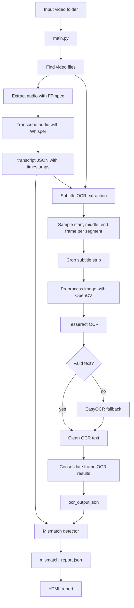

# Burn-in Subtitle Checker

Burn-in Subtitle Checker compares the subtitles visible inside a video frame against the text transcribed from the video's audio. It is designed for videos where subtitles are already rendered into the image, so there is no separate `.srt` file to inspect.

The tool extracts audio, transcribes speech with Whisper, reads burned-in subtitle text with OCR, compares both text sources, and generates JSON plus HTML reports that identify `OK`, `REVIEW`, `MISMATCH`, and `OCR_FAILED` segments.

## Architecture Flow



## End-to-End Pipeline

1. **Video discovery**
   `main.py` scans the input directory for supported video files: `.mp4`, `.mov`, `.mkv`, `.avi`, and `.webm`.

2. **Audio extraction**
   `src/transcriber.py` calls FFmpeg to extract mono `16 kHz` WAV audio from each video.

3. **Speech transcription**
   Whisper transcribes the audio and creates a timestamped transcript JSON containing:
   - detected language
   - segment start time
   - segment end time
   - spoken text

4. **Subtitle frame sampling**
   `src/subtitle_extractor.py` uses each transcript segment's timestamps and samples three frames:
   - start frame at `15%` of segment duration
   - middle frame at `50%`
   - end frame at `85%`

5. **Subtitle strip extraction**
   The frame is cropped to the bottom subtitle region. Padding and uniform columns are removed so OCR focuses on subtitle text instead of video borders.

6. **OCR preprocessing**
   OpenCV converts the subtitle region into a cleaner OCR image:
   - grayscale conversion
   - noisy corner masking
   - real text-row detection
   - resize before thresholding
   - text style detection
   - outlined white subtitle repair
   - adaptive thresholding
   - black-text-on-white normalization

7. **OCR engine selection**
   Tesseract runs first. If its result is empty, invalid, or noisy, EasyOCR is used as a fallback.

8. **OCR cleanup and validation**
   OCR output is normalized and cleaned to reduce repeated-character hallucinations such as repeated Indic characters, repeated short tokens, or repeated noisy fragments. The extractor also warns when an OCR image shape looks suspiciously tall, which can indicate accidental stacked strips.

9. **Frame result consolidation**
   Start, middle, and end OCR results are consolidated. Stable subtitles keep the cleanest candidate; changing subtitles are joined only when they are meaningfully different and not noisy.

10. **Mismatch scoring**
    `src/mismatch_detector.py` normalizes transcript and OCR text, then uses RapidFuzz token-sort similarity to classify each segment:
    - `OK`: score >= `0.8`
    - `REVIEW`: score >= `0.6`
    - `MISMATCH`: score < `0.6`
    - `OCR_FAILED`: OCR text is missing or too short

11. **Report generation**
    `src/report_generator.py` creates an HTML report with segment timings, audio transcript, OCR text, score, and status.

## Tech Stack

| Area | Technology |
| --- | --- |
| Language | Python 3.12+ |
| CLI orchestration | `argparse` |
| Audio extraction | FFmpeg |
| Speech-to-text | OpenAI Whisper |
| Image processing | OpenCV, NumPy |
| OCR primary engine | Tesseract via `pytesseract` |
| OCR fallback engine | EasyOCR |
| Text comparison | RapidFuzz |
| Config loading | `python-dotenv` |
| Output formats | JSON, HTML |
| Dependency management | `uv`, `pyproject.toml`, `requirements.txt` |

## Requirements Fulfilled

- Processes a folder of videos in batch.
- Extracts audio from each video automatically.
- Generates timestamped speech transcripts.
- Detects the OCR language from Whisper language output.
- Crops only the subtitle region instead of OCRing the full frame.
- Handles different subtitle styles, including outlined white text.
- Uses Tesseract first and EasyOCR as a fallback.
- Cleans OCR hallucinations caused by noisy subtitle regions.
- Detects suspicious OCR image aspect ratios that may indicate stacked strips.
- Consolidates start, middle, and end frame OCR results for each transcript segment.
- Compares audio transcript text with burned-in subtitle OCR text.
- Produces machine-readable JSON reports.
- Produces a readable HTML mismatch report.
- Logs processing details to `debug.log` for diagnosis.

## Project Structure

```text
.
|-- main.py
|-- README.md
|-- pyproject.toml
|-- requirements.txt
|-- src
|   |-- mismatch_detector.py
|   |-- report_generator.py
|   |-- subtitle_extractor.py
|   `-- transcriber.py
|-- input_second
`-- output_third_B
```

Key files:

- `main.py`: batch runner and pipeline orchestrator.
- `src/transcriber.py`: FFmpeg audio extraction and Whisper transcription.
- `src/subtitle_extractor.py`: frame sampling, subtitle preprocessing, OCR, cleanup, and consolidation.
- `src/mismatch_detector.py`: transcript-versus-OCR comparison.
- `src/report_generator.py`: HTML report creation.

## Setup

Install Python dependencies:

```bash
pip install -r requirements.txt
```

The code also imports `whisper` and `easyocr`. If they are not already installed in your environment, install them:

```bash
pip install openai-whisper easyocr
```

Install system dependencies:

- **FFmpeg** must be available on `PATH`.
- **Tesseract OCR** must be installed separately.
- Hindi/Kannada/English Tesseract language data should be installed for the languages you want to process.

Create a `.env` file with the Tesseract executable path:

```env
TESSERACT_FILE_PATH=C:\Program Files\Tesseract-OCR\tesseract.exe
```

## Usage

Put videos in the input folder, then run:

```bash
python main.py --input-dir input_second --output-dir output_third_B
```

Default values:

```bash
python main.py
```

This reads from `input_second` and writes to `output_third_B`.

## Output

For each video, the pipeline creates a folder under the output directory:

```text
output_third_B
|-- audio
|   `-- video_name.wav
`-- video_name
    |-- video_name.wav.json
    |-- ocr_output.json
    |-- mismatch_report.json
    |-- mismatch_report.html
    |-- original_seg*_*.jpg
    |-- cropped_seg*_*.jpg
    `-- debug_seg*_*.jpg
```

Important outputs:

- `*.wav.json`: Whisper transcript with timestamps.
- `ocr_output.json`: OCR text extracted from video frames.
- `mismatch_report.json`: comparison results with scores and statuses.
- `mismatch_report.html`: human-readable report.
- `debug_seg*.jpg`: preprocessed OCR images for debugging.
- `debug.log`: full processing log.

## OCR Reliability Notes

The extractor includes several protections for common OCR failure modes:

- It warns when an OCR image is too tall relative to its width, which can indicate accidental stacked subtitle strips.
- It removes repeated character and bigram hallucinations.
- It rejects text with too many suspicious symbols.
- It penalizes repeated short tokens and repeated fragments.
- It avoids selecting the longest OCR result blindly during consolidation.

From recent debugging, the saved OCR images were not stacked: they had an aspect ratio around `0.07-0.085`. The repeated text issue was more likely caused by noisy single-frame OCR being accepted as valid text. The current validation and consolidation logic is designed to reduce that failure mode.

## Supported Languages

Whisper language codes are mapped to Tesseract language codes:

| Whisper | Tesseract | Language |
| --- | --- | --- |
| `hi` | `hin` | Hindi |
| `en` | `eng` | English |
| `kn` | `kan` | Kannada |

EasyOCR fallback uses:

| Tesseract | EasyOCR |
| --- | --- |
| `hin` | `hi` |
| `eng` | `en` |
| `kan` | `kn` |

## Debugging

Check `debug.log` when OCR output looks strange. Useful signals:

- `Suspicious Tesseract OCR image shape`: possible stacked OCR image.
- `Rejected noisy OCR text`: OCR produced text-like noise and fallback or failure was triggered.
- `engine=tesseract` or `engine=easyocr`: shows which OCR engine produced each frame result.
- `Consolidated stable` or `Consolidated changed subtitle`: shows how start, middle, and end OCR samples were merged.

Open the saved debug images to inspect what OCR actually received:

```text
debug_seg0_start.jpg
debug_seg0_mid.jpg
debug_seg0_end.jpg
```

If each image contains only one subtitle strip, stacking is unlikely. If one image contains multiple vertical strips, the issue is happening before OCR.
